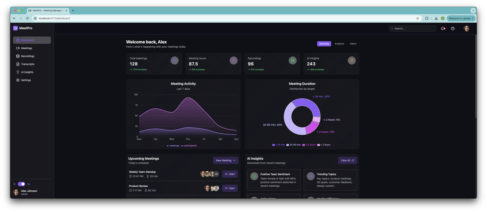
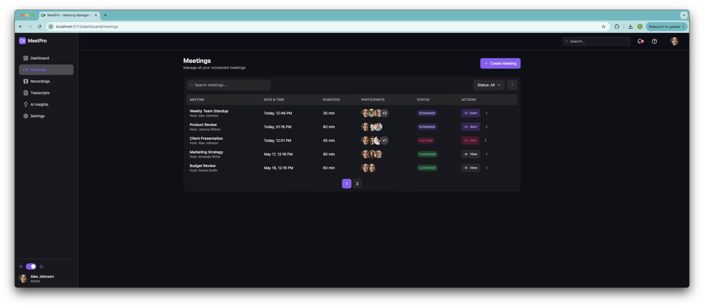
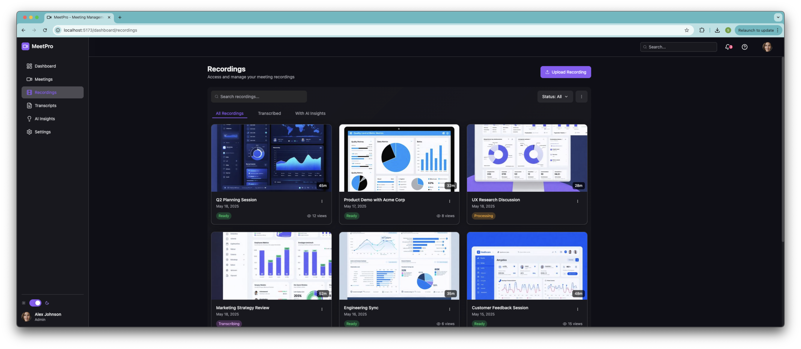
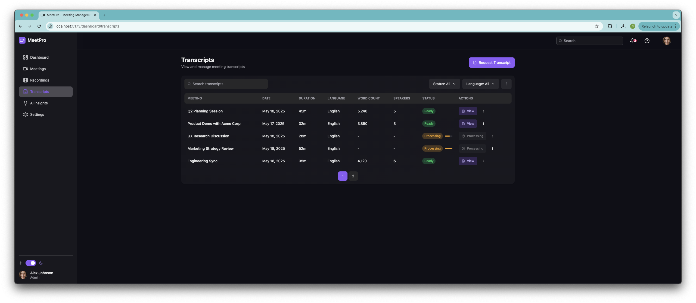
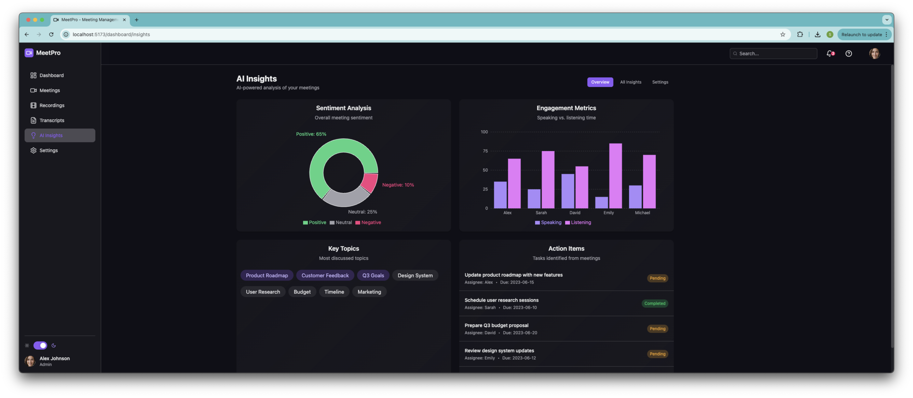

# MeetPro - Meeting Management Dashboard

MeetPro is a modern, responsive meeting management dashboard built with React, TypeScript, and HeroUI. This project was created using the [HeroUI.chat](https://heroui.chat) platform, leveraging its powerful UI components and theming capabilities.

## Video Demo

🎥 [Watch MeetPro Demo](./docs/videos/demo.mov)

## Screenshots

### Dashboard Overview

*Main dashboard showing key metrics and analytics*

### Meeting Management

*Meeting list and management interface*

### Recording Management

*Recording library and playback interface*

### Transcript Management

*Transcript viewer and management interface*

### Insights & Analytics

*Detailed analytics and insights dashboard*


## Features

- 📊 Interactive Dashboard with key metrics
- 📅 Meeting Management
- 🎥 Recording Management
- 📝 Transcript Management
- 📈 Insights and Analytics
- ⚙️ Settings Configuration
- 🌓 Dark/Light Theme Support
- 🎨 Modern UI with HeroUI Components
- 📱 Fully Responsive Design

## Tech Stack

- React 18
- TypeScript
- HeroUI (@heroui/react, @heroui/use-theme)
- TailwindCSS
- React Router
- Framer Motion
- Recharts
- Vite

## Installation

1. Clone the repository:
```bash
git clone [your-repository-url]
cd meetpro
```

2. Install dependencies:
```bash
npm install
```

3. Start the development server:
```bash
npm run dev
```

4. Build for production:
```bash
npm run build
```

## Project Structure

```
src/
├── components/     # Reusable UI components
├── hooks/         # Custom React hooks
├── layouts/       # Layout components
├── pages/         # Page components
├── App.tsx        # Main application component
└── main.tsx       # Application entry point
```

## Available Scripts

- `npm run dev` - Start development server
- `npm run build` - Build for production
- `npm run lint` - Run ESLint
- `npm run preview` - Preview production build

## Environment Setup

The project uses Vite as the build tool. Make sure you have Node.js installed (version 16 or higher recommended).

## Contributing

1. Fork the repository
2. Create your feature branch (`git checkout -b feature/amazing-feature`)
3. Commit your changes (`git commit -m 'Add some amazing feature'`)
4. Push to the branch (`git push origin feature/amazing-feature`)
5. Open a Pull Request

## License

This project is licensed under the MIT License - see the LICENSE file for details.

## Acknowledgments

- Built with [HeroUI.chat](https://heroui.chat)
- Powered by [Vite](https://vitejs.dev)
- Styled with [TailwindCSS](https://tailwindcss.com)

